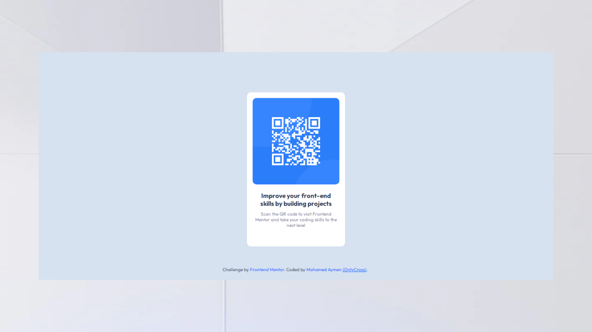

# Frontend Mentor - QR code component solution

This is a solution to the [QR code component challenge on Frontend Mentor](https://www.frontendmentor.io/challenges/qr-code-component-iux_sIO_H). Frontend Mentor challenges help you improve your coding skills by building realistic projects. 

## Table of contents

- [Frontend Mentor - QR code component solution](#frontend-mentor---qr-code-component-solution)
  - [Table of contents](#table-of-contents)
  - [Overview](#overview)
    - [Screenshot](#screenshot)
    - [Links](#links)
  - [My process](#my-process)
    - [Built with](#built-with)
    - [What I learned](#what-i-learned)
    - [Continued development](#continued-development)
  - [Author](#author)

## Overview

### Screenshot

### Links

- Solution URL: [Add solution URL here](https://your-solution-url.com)
- Live Site URL: [https://onlycross12.github.io/QRCode-FrontEndMonetor-Challenge/](https://onlycross12.github.io/QRCode-FrontEndMonetor-Challenge/)

## My process

### Built with

- HTML5
- CSS3
- Position
- Transition
- [Google Fonts](https://fonts.google.com/) - For fonts

### What I learned

- For real i didn't learn anything new but it was fun completing this challenge

### Continued development

- How To Make Responsive Websites For Multi Devices

## Author

- GitHub - [@OnlyCross12](https://github.com/OnlyCross12)
- Frontend Mentor - [@OnlyCross12](https://www.frontendmentor.io/profile/OnlyCross12)
- Twitter - [@9_gxu](https://twitter.com/9_gxu)